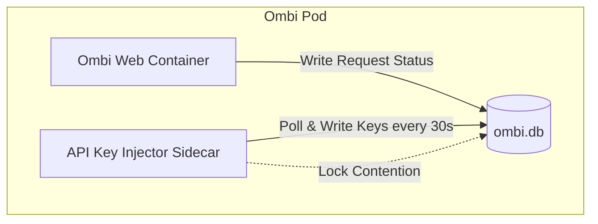

+++
title = "Solving SQLite Database Locks & Schema Contention in Ombi"
date = "2026-06-21"
description = "Investigating SQLite Error 5: 'database is locked' and API key injection race conditions in a containerized media stack."
tags = ["sqlite", "debugging", "kubernetes", "database", "python"]
categories = ["debugging"]
+++

## The Symptom

In my containerized home server cluster, users request movies and TV shows through **Ombi**, which are meant to sync automatically to **Radarr** and **Sonarr** for indexing. 

However, we noticed that newly approved movie requests were stuck in Ombi. Checking the Ombi container logs revealed a series of database warnings:

```
Microsoft.Data.Sqlite.SqliteException (0x80004005): SQLite Error 5: 'database is locked'.
   at Microsoft.Data.Sqlite.SqliteConnection.ExecuteNonQuery(String commandText)
   ...
```

The app database (`ombi.db`) was locked, preventing the sync engine from updating request records and completing the api handoffs to Radarr.

---

## Forensic Analysis & Root Cause

I inspected the deployment configuration to trace what processes were opening file descriptors to the SQLite database files.



The database lock contention was caused by a combination of two issues:

### 1. The Key Injector Sidecar Loop
Because the database is deployed in a stateless Kubernetes container, an `api-key-injector` sidecar script (`inject_keys.py`) was configured to dynamically inject Radarr and Sonarr API keys directly into Ombi's SQLite configuration tables. 

However, the script was querying and updating the database every **30 seconds** in an infinite loop. Since SQLite does not support concurrent write operations (it locks the entire database file for writes), the sidecar was constantly colliding with Ombi’s write requests.

### 2. JSON Schema Deserialization Failures
The injector script was attempting to write a nested settings JSON schema into the flat `RadarrSettings` table. Ombi’s internal ORM expects a flat key-value model here and stores the nested configurations in a separate table (`RadarrCombinedModel`). 

Because of this mismatch, Ombi threw deserialization exceptions on startup, causing it to trigger retries that further flooded the database transaction log.

### 3. Missing Root Path Pointers
Even when the database was temporarily unlocked, Radarr rejected the API requests from Ombi because the default root storage folder was set to `null` instead of a valid media directory.

---

## The Resolution

To resolve the issue, I refactored the key injector script and updated the database mappings:

1. **Refactored `inject_keys.py`**:
   Updated the query mappings to write the flat key-value schema to `RadarrSettings` and the combined nested settings JSON schema to `RadarrCombinedModel`.
2. **Eliminated Write Contention**:
   Modified the sidecar script to run **exactly once** on startup. Once the keys are successfully injected, the script enters a 24-hour sleep state, eliminating the 30-second poll-and-write locks.
3. **Set Default Paths**:
   Updated the configuration to point to real system storage paths (`/media/Movies` for Radarr, `/media/TVShows` for Sonarr).

After rolling out the updated sidecar configurations, the database locks cleared instantly, and all queued movie requests synced to Radarr successfully.
