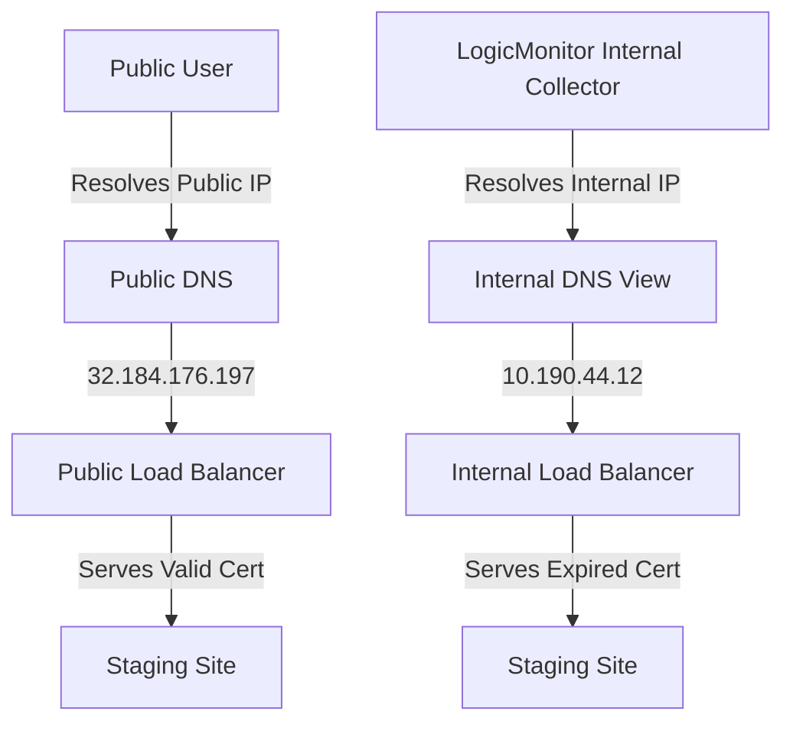

+++
title = "Diagnosing Split-Horizon DNS & SSL Certificate Mismatches"
date = "2026-06-15"
description = "Troubleshooting certificate mismatch errors in internal staging networks due to stale DNS views and load balancer caches."
tags = ["dns", "ssl", "networking", "troubleshooting", "load-balancing"]
categories = ["debugging"]
+++

## The Symptom

Internal monitoring agents and collectors (specifically **LogicMonitor**) began throwing alerts indicating that the staging environment endpoint `stage-api.cloud.enterprise.com` was serving an invalid/expired SSL certificate. 

Curiously, developers accessing the staging site from their home connections reported no SSL warnings—the site loaded cleanly with a valid certificate expiring in December 2026.

---

## Technical Auditing & DNS Resolution

To diagnose this behavior, we had to isolate what certificate was being served, to whom, and by which server.



### 1. Verification of Public Endpoint
We ran external query diagnostics using `curl` and `openssl` against the public endpoint:

```bash
openssl s_client -connect stage-api.cloud.enterprise.com:443 -servername stage-api.cloud.enterprise.com
```

The output showed a valid certificate:
- **Common Name (CN)**: `*.cloud.enterprise.com`
- **Validity**: Expires December 2026
- **Resolved IPs**: `32.184.176.197` and `44.230.127.219`

### 2. Verification of Internal Endpoint
We then ran the same diagnostics directly from the internal network where the LogicMonitor collector agent resides. 

The internal query resolved to a private subnet address: **`10.190.44.12`**. 
Querying this IP directly for the SSL handshake returned an **expired certificate** (which had expired several weeks prior).

---

## Root Cause: Split-Horizon DNS Views

This system uses **split-horizon DNS** to route traffic differently depending on the source:
- **External users** hitting the domain resolve to the public AWS Application Load Balancers, which had the updated SSL certificate applied.
- **Internal systems** (such as API collectors and monitoring nodes) resolve to an internal AWS Application Load Balancer via private Route 53 Hosted Zones.

When the SSL certificates were updated, the automation pipeline successfully updated the listener certificates on the public ALBs. However, the private load balancer's listener configuration was missed, meaning it continued to serve the stale certificate from the default ACM profile to internal clients.

Additionally, caching configurations on the internal collector nodes prevented them from recognizing subsequent DNS route adjustments immediately.

---

## The Resolution

To fix the mismatch:
1. **Applied Certs to Private ALBs**: Codified and applied the updated ACM certificate resource association to the internal load balancers.
2. **DNS Cache Flush**: Flushed the local resolver caches on the LogicMonitor collector VMs.
3. **Automated Verifications**: Integrated an automated check into the Route 53 health-check modules to query *both* public and private DNS endpoints during deployment runs, ensuring certificate parity.

---

This work was part of the broader [Enterprise Staging & OpenTofu Codification](/projects/enterprise-stage-opentofu/) project.
