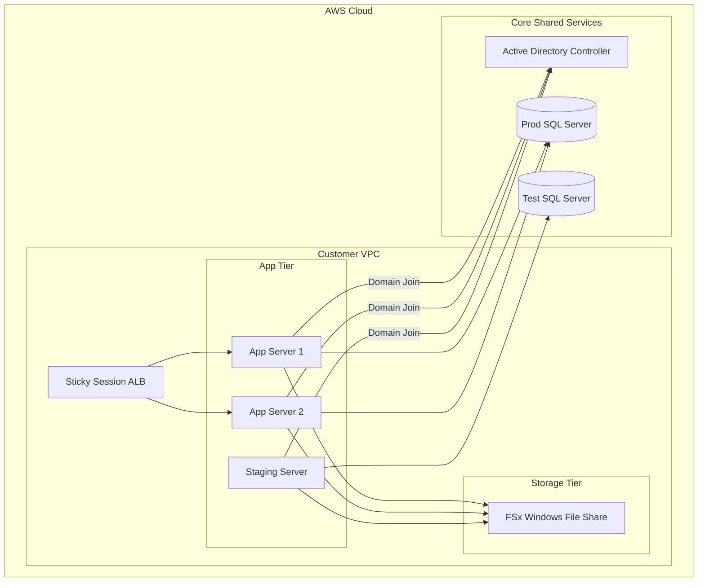

+++
title = "Enterprise Staging & OpenTofu Codification"
date = "2026-06-21"
description = "Diagnosing multi-tier domain resolution issues and implementing automated Active Directory + multi-cloud provisioning using OpenTofu."
github = "https://github.com/finn-e"
icon = "fa-solid fa-cloud"
subtitle = "AWS Infrastructure as Code & Windows Domain Automation"
stack = ["OpenTofu", "AWS", "Route 53", "Active Directory", "PowerShell", "SSM Run Command"]
featured = false
+++

## Overview

This project focuses on the automation of hosted customer environments on AWS and the resolution of staging domain connectivity bottlenecks. 

It implements modular **OpenTofu** configurations to provision isolated multi-tier networks, alongside automated Active Directory (AD) domain migration workflows driven by PowerShell scripting and AWS Systems Manager (SSM) Run Commands.

## Codified Infrastructure Architecture

The environments are split into two execution stages:

### Set 1: Bootstrap Environment
- Provisions a single app server pointing directly to the test database instance to validate base connectivity and baseline configurations.

### Set 2: Load-Balanced Production Cloning
- Provisions load-balanced application instances (`app-prod1` and `app-prod2`) behind a sticky-session Application Load Balancer (ALB) pointing to the production database cluster.
- Automatically provisions a staging instance (`app-stage`) pointing to the test database.
- Utilizes **Route 53** with active-passive DNS routing records and health checks to manage failover.

---

## Active Directory Domain Integration & Orchestration

Cloning application environments in an AD-managed enterprise network causes SID and hostname conflicts on the domain controllers. To bypass manual operations, the OpenTofu code coordinates an automated migration lifecycle:

1. **Domain Leave**: An SSM script removes the target Windows Server instance from the domain.
2. **State Transition**: The instance is stopped, and an AMI image is compiled.
3. **Domain Join**: Cloned instances (`app-prod2`, `app-stage`) boot up, run a sysprep-equivalent script to rename the computer, and re-join the AD domain with encrypted secrets.
4. **Database Sync**: An SSM PowerShell script runs a native SQL backup from the test database cluster to an FSx share and restores it onto the production database instance to populate the environment.

---

## Staging Resolution Diagnostics

- **Investigation**: Troubleshooted domain resolution issues for the staging URL (`stage.cloud.enterprise.com`).
- **Root Cause**: Identified differences in DNS views (split-horizon DNS) causing internal collectors (e.g. LogicMonitor) to resolve stale IP addresses while public DNS resolved correctly.
- **Resolution**: Implemented localized hosts override files, DNS routing table updates, and SSL cert verification checkpoints to ensure matching states across public and private scopes.
