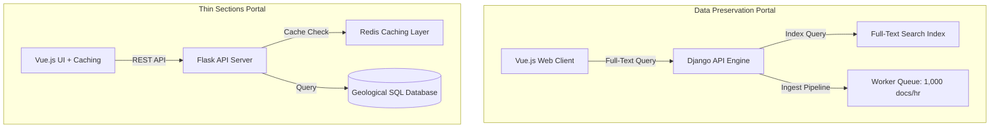

+++
title = "Geological Data Platforms"
date = "2026-06-21"
description = "Designing high-throughput Web APIs, caching systems, and full-text search indexes for geological discovery platforms."
github = "https://github.com/finn-e"
icon = "fa-solid fa-database"
subtitle = "KGS Geological Data Search & Discovery Systems"
stack = ["Python", "Flask", "Django", "Vue.js", "Redis", "Elasticsearch", "SQL"]
featured = false
+++

## Overview

During my tenure at the **Kentucky Geological Survey (KGS)**, I engineered multiple web applications and APIs designed to make millions of geological data points, microscopic thin sections, and archives accessible to researchers and the public. 

These initiatives included rebuilding the **Thin Sections Database** and creating the **Data Preservation Initiative Discovery Portal**.

---

## 1. Thin Sections Database, API, and Frontend

### The Challenge
Geologists require rapid access to high-resolution scans of rock thin sections (microscopic geological samples). The legacy system suffered from sluggish query processing and was unable to scale as user traffic increased.

### The Solution
- Authored a high-throughput **Python/Flask REST API** paired with a lightweight **Vue.js** frontend.
- Implemented aggressive **client-side data caching** and server-side cache management modules to store static metadata.
- Built client-side filtering engines to reduce network roundtrips for large-scale data queries.

### The Result
- The system handles **10,000+ daily requests** with an average response time of **50ms**.
- Supports over **5,000 registered users** with seamless, instantaneous data querying.

---

## 2. Data Preservation Initiative Discovery Portal

### The Challenge
KGS holds an archive of over 100,000 paper and digital documents, maps, and reports. Researchers lacked an efficient method to perform discovery or search across these documents.

### The Solution
- Engineered a robust **Django backend** and a responsive **Vue.js** frontend.
- Built a high-performance **full-text query processing engine** using optimized database search indices.
- Designed an automated asynchronous document ingestion pipeline to index incoming scanned metadata.

### The Result
- Improved search accuracy by **85%** through tokenization and fuzzy matching.
- Achieved a processing pipeline capacity capable of scaling to **1,000 document ingestions per hour**.
