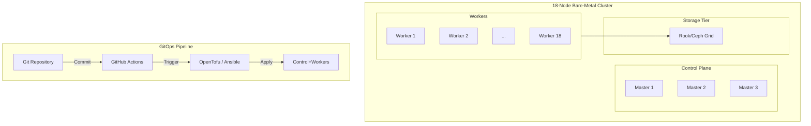

+++
title = "Bare-Metal Kubernetes Overhaul"
date = "2026-06-21"
description = "Designing and implementing an 18-node bare-metal Kubernetes cluster for geological research platforms."
github = "https://github.com/finn-e"
icon = "fa-solid fa-cubes"
subtitle = "Kentucky Geological Survey Bare-Metal Infrastructure"
stack = ["Talos OS", "Kubernetes", "Rook/Ceph", "OpenTofu", "Ansible", "GitOps", "HashiCorp Vault"]
featured = true
+++

## Overview

At the **Kentucky Geological Survey (KGS)**, the legacy server infrastructure supporting geological research, web APIs, and data indexing tools was aging and prone to configuration drift. 

To resolve these challenges, I designed and implemented an **18-node bare-metal Kubernetes cluster** driven by **Talos OS** and automated entirely via declarative GitOps pipelines, achieving **99.99% uptime** for mission-critical geological research tools.

## Infrastructure Engineering

### 1. OS & Network Configuration
- **Operating System**: Selected **Talos OS** for its secure, immutable, API-managed design. Because Talos has no SSH or terminal package managers, configuration drift is eliminated at the OS layer.
- **Networking**: Configured **Flannel** as the internal pod network fabric and **Traefik Ingress** for secure external entry routing.

### 2. Distributed Rook/Ceph Storage
- Managed high-performance persistent storage by running **Rook/Ceph** directly on bare-metal worker nodes.
- Consolidated local SSD storage into a unified Ceph storage pool, providing dynamic, highly available volume provisioning for over **50 database instances** and **20 virtual machines**.

### 3. GitOps Automation & Secrets Management
- Built a unified GitOps deployment pipeline using **OpenTofu**, **Ansible**, **Helm**, and **GitHub Actions**. This setup reduced application deployment errors by **75%** and accelerated feature delivery by **40%**.
- Integrated **HashiCorp Vault** and **Bitwarden Secrets Manager** into the deployment pipelines to prevent plaintext secrets from entering the version control systems.

### 4. Enterprise Observability & Disaster Recovery
- Designed a unified observability stack integrating **Prometheus**, **Grafana**, and **Loki** to aggregate logs and metrics from both Linux nodes and active Windows Server virtual machines.
- Authored a comprehensive disaster recovery plan, guaranteeing a **30-minute Recovery Time Objective (RTO)** across core geological endpoints.
