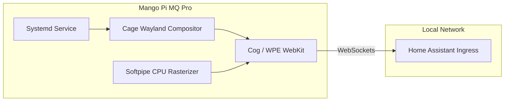

+++
title = "Mango HA Touchscreen Kiosk"
date = "2026-06-21"
description = "A lightweight, responsive Home Assistant dashboard kiosk built on the Mango Pi MQ Pro (RISC-V) Allwinner D1 SoC."
github = "https://github.com/finn-e"
icon = "fa-solid fa-desktop"
subtitle = "RISC-V Allwinner D1 Single-Board Computer Project"
stack = ["RISC-V", "Linux", "Wayland", "Cage", "WPE WebKit", "Home Assistant", "Systemd"]
featured = true
+++

## Overview

This project configures a dedicated, single-purpose Home Assistant kiosk on a **Mango Pi MQ Pro**—a low-cost single-board computer powered by the **Allwinner D1 RISC-V SoC** (single core, T-Head C906). 

To optimize performance and avoid memory starvation, the kiosk operates by running a minimal Wayland compositor (**Cage**) and a lightweight WPE WebKit browser engine (**Cog**), bypassing a heavy desktop environment.



## System Constraints & Solutions

Running a modern WebKit browser on a single-core RISC-V SoC with 1GB RAM presents significant resource bottlenecks. The following software adjustments were implemented to stabilize the kiosk:

### 1. Memory Management & Swap Allocation
Standard WebKit engines consume massive memory footprints. Without swap space, the system would immediately trigger the kernel OOM killer:
- **Solution**: Allocated a **4.5 GB swap space** consisting of a 4.0 GB static swapfile on a fast SD card combined with a 238 MB compressed ZRAM device.

### 2. Native EDID Resolution Override
Connecting the board to a 4K touchscreen caused kernel GPU page faults and TLB timeouts due to memory bandwidth limits.
- **Solution**: Forced the display output to **1920x1080** via kernel configuration overrides (`video=HDMI-A-1:1920x1080@60`) to bypass the display's native EDID.

### 3. Software Graphics Rasterization
Standard Debian Sid distributions for Allwinner D1 do not include stable GPU hardware acceleration drivers.
- **Result**: Standardized on **software rasterization** (`softpipe` backend). CPU utilization rests at ~96% during heavy dashboard animations, but coordinates rendering stably without GPU faults.

---

## Technical Investigation: WebKit Threading Hangs

During setup, the Cog browser would regularly hang during initialization. Forensic debugging using `htop` and `strace` identified a threading loop:

```
    PID     TID COMMAND         %CPU WCHAN
    9166    9166 cog              1.0 -
    9166    9363 ebsiteDataStore  0.0 -
    9166    9364 olveDirectories 37.9 -
    9166    9366 gmain            0.0 -
```

- **Root Cause**: The WebKit `ResolveDirectories` thread (`TID 9364`) was spinning in a tight loop at ~38% CPU, while the main browser thread slept in a `futex_wait`. 
- **Investigation**: Bypassed JIT (`JavaScriptCoreUseJIT=0`), sandboxing, and redirected XDG data directories to verify it was not disk IO bottlenecks. The behavior points directly to a low-level **threading or atomic synchronization bug** in WPE WebKit's RISC-V implementation, looping indefinitely on the T-Head C906 core. Work is ongoing to patch the atomic locks in WebKit's build.
