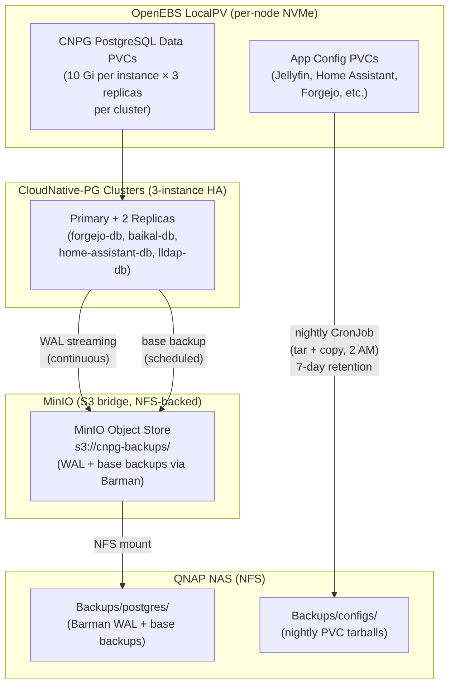

+++
title = "Mimisbrunnr: Cluster Architecture Deep-Dive"
date = "2026-07-10"
description = "A detailed walkthrough of the Mimisbrunnr homelab cluster: traffic flow, auth layer, database HA strategy, storage, and backup pipeline — all codified in OpenTofu."
github = "https://github.com/finn-e"
icon = "fa-solid fa-diagram-project"
subtitle = "Talos Linux · MetalLB · Traefik · Authelia · CloudNative-PG"
stack = ["Talos OS", "Kubernetes", "OpenTofu", "MetalLB", "Traefik", "Authelia", "CloudNative-PG", "MinIO", "OpenEBS"]
featured = false
+++

This page is a deep-dive companion to the [Mimisbrunnr home server project](/projects/mimisbrunnr-home-server/). While that page gives a high-level overview of what runs on the cluster, this one explains *how* the pieces fit together — traffic routing, authentication, the database HA strategy, storage, and the backup pipeline. The full OpenTofu configuration is being prepared for public release at [github.com/finn-e](https://github.com/finn-e) (portfolio_tofu repo).

---

## Overview

**Mimisbrunnr** is a three-node bare-metal Kubernetes cluster running on **Talos Linux** — a minimal, immutable OS that exposes only a gRPC API surface; no SSH, no shell, no package manager. Every piece of cluster state is declared in OpenTofu and applied via the Kubernetes/Talos providers. There is no snowflake configuration and no configuration drift by construction.

The three nodes double as both control plane and worker nodes (a common pattern for small homelab clusters). Each runs the full Kubernetes control plane alongside workload pods.

---

## Traffic Flow

Incoming requests — whether from the LAN or via Cloudflare Tunnel — hit a **MetalLB** virtual IP (`192.168.1.80`) assigned to the **Traefik** ingress controller. Traefik terminates TLS (via cert-manager + Let's Encrypt) and routes requests to backend services. Most services are protected by an **Authelia** ForwardAuth middleware that intercepts unauthenticated requests and redirects them to the SSO portal before allowing access.

```mermaid
flowchart TD
    Client["Browser / App Client"]
    CF["Cloudflare Tunnel\n(external access)"]
    VIP["MetalLB VIP\n192.168.1.80"]
    Traefik["Traefik Ingress Controller\n(TLS termination, routing)"]
    AuthMW["Authelia ForwardAuth\nMiddleware"]
    AuthSvc["Authelia SSO Portal\n(internal DNS name)"]
    LLDAP["LLDAP\n(LDAP directory)"]

    subgraph Protected Services
        Grafana["Grafana"]
        Forgejo["Forgejo"]
        HA["Home Assistant"]
        Navidrome["Navidrome"]
        Media["Jellyfin / Kavita / etc."]
    end

    subgraph Public / API-bypass
        AdGuard["AdGuard Home\n(192.168.1.81, host-net)"]
    end

    Client -->|LAN| VIP
    CF -->|tunnel| VIP
    VIP --> Traefik
    Traefik -->|ForwardAuth check| AuthMW
    AuthMW -->|not authenticated| AuthSvc
    AuthSvc -->|LDAP bind| LLDAP
    AuthMW -->|authenticated| Protected Services
    Traefik -->|bypass rule| Public / API-bypass
```

### Why Traefik?

Traefik was chosen over Nginx Ingress because its `Middleware` CRD composes cleanly with Authelia's ForwardAuth integration. A single `Middleware` resource in the `auth` namespace pins SSO to any `IngressRoute` cluster-wide via an annotation — no per-service auth config needed.

### AdGuard as cluster DNS

**AdGuard Home** runs with `hostNetwork: true` on a dedicated MetalLB IP (`192.168.1.81`) and acts as the authoritative internal DNS for the homelab domain. Every service hostname resolves to `192.168.1.80` (Traefik VIP) via a wildcard DNS record, which lets Traefik route purely by `Host` header with no per-record DNS maintenance.

---

## Authentication & SSO Layer

The auth stack has two components managed together in a dedicated `auth` namespace:

| Component | Role |
|-----------|------|
| **LLDAP** | Lightweight LDAP directory — stores users, groups, and passwords. Exposes a standard LDAP interface on port 389 and an admin UI on port 17170. Backed by a 3-instance CloudNative-PG cluster. |
| **Authelia** | ForwardAuth proxy — validates sessions, enforces MFA, manages session cookies scoped to the homelab domain. Calls LLDAP over in-cluster LDAP for credential verification. |

Authelia's access control is policy-driven in its ConfigMap. Sensitive paths (media automation `/api/` endpoints, the auth portal itself) carry an explicit `bypass` policy; everything else under the homelab domain defaults to `one_factor`. The ForwardAuth response headers (`Remote-User`, `Remote-Groups`, `Remote-Email`) are forwarded to backends that consume them (e.g., Grafana, Navidrome).

---

## Data Layer

The second diagram shows how persistent data is stored, replicated, and backed up.



### Storage: OpenEBS LocalPV Hostpath

All PVCs use **OpenEBS LocalPV Hostpath** — the simplest possible persistent storage model. Each volume is a directory on the local NVMe disk of the node that scheduled the pod. This gives near-native disk performance with zero network overhead, at the cost of node-affinity: if a node dies, pods with LocalPV volumes have to wait for that node to return (or a manual recovery).

For stateless workloads and media (backed by NFS mounts to the NAS), this is a fine trade. For the databases, node failure is handled at the application layer by CloudNative-PG's replication.

### CloudNative-PG (CNPG)

CNPG manages four PostgreSQL clusters, each configured as a 3-instance primary/replica set. CNPG handles:
- Automatic leader election and failover (surviving a single node loss without data loss)
- WAL archiving via Barman to the MinIO S3 endpoint
- Scheduled base backups

Each CNPG instance's data volume is a LocalPV on the node it lands on. Because instances are spread across the three nodes by CNPG's scheduling policy, losing one node leaves two replicas intact for an immediate election.

### MinIO as S3 bridge

Rather than shipping database backups directly to a cloud S3 bucket, MinIO provides an S3-compatible endpoint inside the cluster. Its backing store is an NFS PVC mounted from the QNAP NAS (`Backups/postgres/`). This means:
- CNPG/Barman speaks standard S3 (no special NAS plugin needed)
- Backups land on the NAS automatically, without a separate sync job
- The NAS is the single durable copy; a secondary offsite destination can be added later

### Nightly config backups

Application config PVCs (Jellyfin, Home Assistant, Radarr, Sonarr, Forgejo, etc.) are not replicated — they're backed up nightly by a `CronJob` per application. Each job mounts the source PVC read-only and the NAS PVC read-write, writes a timestamped tarball (`YYYYMMDD-HHMMSS.tar.gz`), and prunes files older than 7 days.

---

## Monitoring & Observability

The **kube-prometheus-stack** Helm release deploys:
- **Prometheus** — scrapes metrics from all cluster components (node-exporter, kube-state-metrics, Traefik, CNPG, etc.) and evaluates alerting rules
- **Grafana** — dashboards for cluster health, database replication lag, storage usage, and network throughput; SSO-integrated via the Authelia ForwardAuth middleware

A summary of key services is also available on the [Cluster Status](/status/) page (delayed 24 hours).

---

## Media Automation Stack

The download pipeline runs entirely within a `media` namespace:

- **Sonarr / Radarr** — TV and movie managers; their `/api/` paths carry an Authelia bypass rule so clients (e.g., Overseerr, Ombi) can reach them programmatically
- **qBittorrent** — runs with a **NordVPN WireGuard sidecar** container that injects a VPN tunnel into the pod's network namespace, routing all torrent traffic through the VPN while leaving the management UI reachable via Traefik
- **FlareSolverr** — headless Chromium proxy for bypassing Cloudflare challenges on indexers

---

## IaC Philosophy

The entire cluster state — namespaces, deployments, services, ingresses, CNPG clusters, CronJobs, secrets, and Helm releases — is declared in OpenTofu. `tofu apply` from a clean state brings up the full stack. Secrets are generated by `random_password` resources and stored in Kubernetes Secrets; no plaintext secrets exist in the repository.

The sanitized public version of this configuration (with secrets replaced by variables and an example `.tfvars` file) is being prepared as a portfolio reference at [github.com/finn-e](https://github.com/finn-e).
