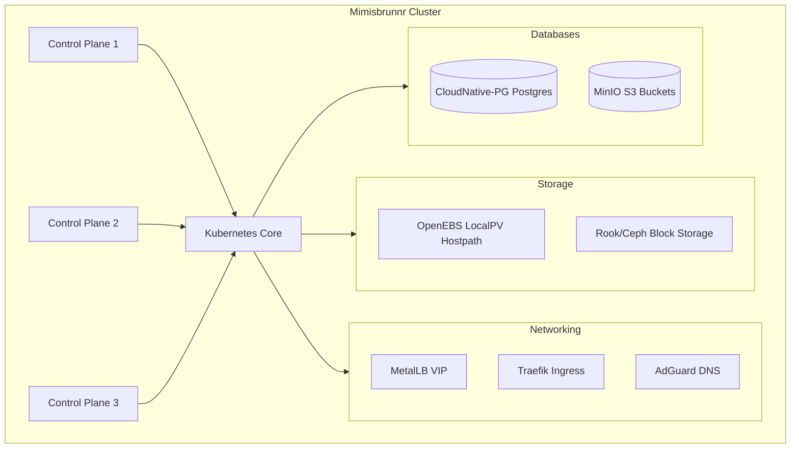

+++
title = "Mimisbrunnr Home Server Cluster"
date = "2026-06-21"
description = "A self-hosted, high-availability Kubernetes cluster running on Talos Linux, codified with OpenTofu."
github = "https://github.com/finn-e"
icon = "fa-solid fa-server"
subtitle = "Talos Linux & OpenTofu Kubernetes Homelab"
stack = ["Talos OS", "Kubernetes", "OpenTofu", "Rook/Ceph", "CloudNative-PG", "Authelia", "Traefik"]
featured = true
+++

## Overview

**Mimisbrunnr** is a secure, immutable, and fully automated bare-metal home server cluster. Built on top of **Talos Linux**, a minimal Linux distribution designed specifically for running Kubernetes, the entire infrastructure and application stack is codified and provisioned using **OpenTofu**.

## Infrastructure Architecture

### 1. Control Plane & Networking
- **Nodes**: Three physical nodes with static IPs (`192.168.1.42` - `192.168.1.44`) configured as a multi-master control plane.
- **Load Balancing**: **MetalLB** handles IP allocation on the local subnet (`192.168.1.80` - `192.168.1.90`).
- **Ingress**: **Traefik Ingress Controller** exposed on a shared VIP (`192.168.1.80`) handles SSL termination and routing.
- **DNS**: **AdGuard Home** acts as the network-wide DNS server and DHCP authority, running with host networking.

### 2. High-Availability Database Layer
- **CloudNative-PG**: A Postgres operator manages highly-available clustered databases in a 3-instance primary/replica setup. Databases are provisioned for Authelia, Home Assistant, LLDAP, and Forgejo.
- **Backup Strategy**: Daily database backups are streamed using Barman to a local **MinIO** S3 bucket, which replicates offsite.
- **NFS backups**: Nightly cronjobs capture application config PVCs and copy them as timestamped tarballs to a QNAP NAS.

### 3. Identity & Single Sign-On (SSO)
- **Directory Services**: **LLDAP** acts as a lightweight LDAP directory service.
- **Auth Portal**: **Authelia** provides modern Multi-Factor Authentication (MFA) and Single Sign-On (SSO) integration across the cluster services (routing via `auth.treee.house`).

---

## Deployed Applications

- **Home Automation**: **Home Assistant** runs with host networking for direct discovery of IoT devices.
- **Media Delivery**: **Jellyfin** (media server), **Navidrome** (music streaming via LDAP auth), and **Kavita** (digital library).
- **Automation Pipeline**: **Sonarr**, **Radarr**, **Ombi**, and **qBittorrent** (isolated with a secure NordVPN WireGuard sidecar to route traffic privately).
- **ESP32 Gateway**: **PicFrames** slideshow gateway server (manages e-paper bitmap distribution and OTA firmware updates).
