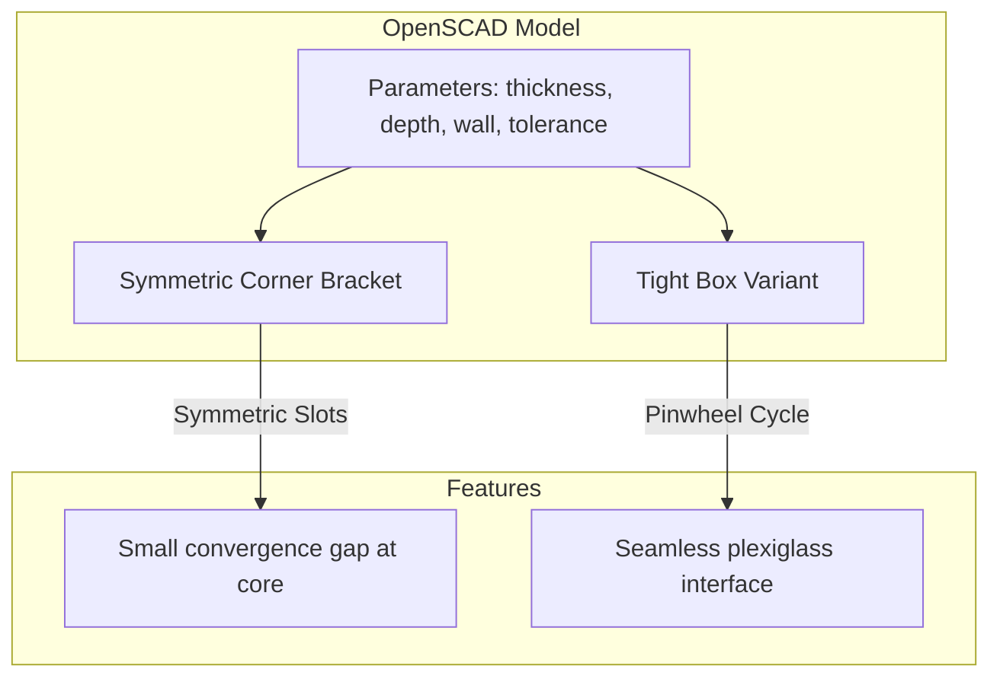

+++
title = "Parametric 3D-Printable Corner Brackets"
date = "2026-06-21"
description = "A parametric 3D-printable corner bracket designed in OpenSCAD to hold three intersecting sheets of plexiglass at right angles."
github = "https://github.com/finn-e"
icon = "fa-solid fa-cube"
subtitle = "OpenSCAD Parametric Hardware Design"
stack = ["OpenSCAD", "3D Printing", "CAD", "Parametric Modeling"]
featured = false
+++

## Overview

This project defines a 3D-printable corner bracket designed in **OpenSCAD** that holds three sheets of plexiglass meeting at right angles—forming the secure corner of a cube, enclosure, or display case.

The design is fully **parametric**: adjusting variables at the top of the file automatically re-calculates all slot widths, tolerances, wall thicknesses, and structural features for rendering and exporting to STL.

## Key Parameters

| Parameter | Default | Description |
|---|---|---|
| `plexi_thickness` | `3 mm` | Thickness of the plexiglass sheets |
| `slot_depth` | `15 mm` | How far each sheet slides into its slot |
| `wall` | `4 mm` | Solid material thickness surrounding the slots |
| `slot_tolerance` | `0.2 mm` | Extra clearance added to slot width to ensure slide-fit |

---

## Design Variants

### 1. Standard Symmetric Bracket
Provides three orthogonal slots (XY, XZ, YZ planes). The sheets slide in and meet at the center. This design is simple and prints easily, but leaves a tiny gap at the innermost convergence point of the three sheets.

### 2. Tight Box Variant
To create a seamless, flush corner enclosure, I designed a **tight box variant** featuring a cyclic (pinwheel) extension schema. Each sheet extends one plexiglass-thickness further into the adjacent slot arm, filling the gaps:
- **XY sheet** extends further in X (into the YZ arm)
- **XZ sheet** extends further in Z (into the XY arm)
- **YZ sheet** extends further in Y (into the XZ arm)

This cyclic layout ensures the sheets lock together flush against each other without conflicting or requiring complex manual trimming.
