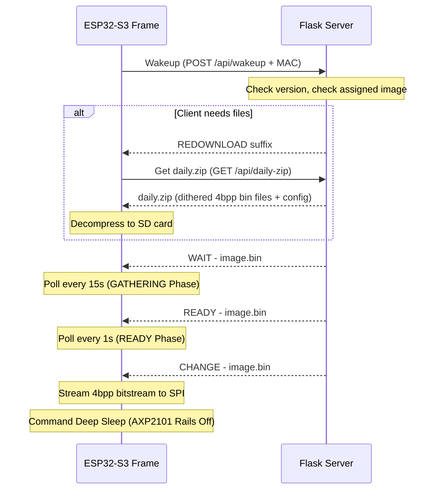

+++
title = "PicFrames E-Paper Controller"
date = "2026-06-21"
description = "A power-optimized, distributed e-paper slideshow system running MicroPython on ESP32-S3 hardware."
github = "https://github.com/finn-e"
icon = "fa-solid fa-microchip"
subtitle = "MicroPython & ESP32-S3 Hardware Project"
stack = ["MicroPython", "ESP32-S3", "Flask", "Docker", "SPI", "I2C", "PCB Design"]
featured = true
+++

## Overview

This project implements a distributed, battery-optimized e-paper slideshow system designed for a fleet of **Waveshare ESP32-S3-PhotoPainter** frames (7.3″ 6-color Spectra e-paper displays). 

To maximize battery life and simplify client-side hardware, the system splits work between a central server (Flask backend running in Kubernetes) and a fleet of low-power ESP32-S3 MicroPython clients.

## Core Architecture

### 1. Server-Side Dithering & Pre-Processing
Instead of wasting battery processing images on the ESP32-S3 CPU, a central Flask server performs all transformations:
- **EXIF Transposition**: Automatically rotates images based on metadata.
- **Floyd-Steinberg Dithering**: Maps images to the 6 native Spectra display colors (Black, White, Yellow, Red, Blue, Green).
- **Spectra 6 Packing**: Packs pixels 2-per-byte `(pixel_even << 4) | pixel_odd` into a raw 4bpp bitstream `.bin` file of exactly 192,000 bytes. This layout allows the ESP32 to stream bytes directly from the SD card to the display SPI bus without CPU parsing overhead.

### 2. MicroPython Client & Power Optimization
To maximize battery life, the client firmware uses deep sleep and strict power rail isolation:
- **AXP2101 PMIC Management**: Utilizes an I2C controller to configure `DC1`, `ALDO3` (EPD_VCC), and `ALDO4` rails to 3.3V on startup. It explicitly powers down all peripheral rails during deep sleep.
- **Low-Power SPI Driver**: Streams the pre-packaged 192KB image files from the SD card to the display in small 4KB memory chunks, saving RAM.
- **SPI Conflict Resolution**: Configured to use hardware `SPI(1)` (HSPI) instead of `SPI(2)` to avoid pin conflicts with the ESP32-S3's internal flash/PSRAM memory controller, fixing a critical boot-loop crash.
- **Fail-Safe Offline Loop**: If the Wi-Fi network or server is offline, the frame catches the connection timeout (`timeout=5`) and falls back to playing a local slideshow cycle cached on the SD card.

### 3. Multi-Frame 3-Phase Handshake
To synchronize slideshow transitions across frames without inter-device wiring, the server orchestrates a 3-part handshake:
1. **GATHERING**: Nodes wake up and check in. The server flags them if a database update occurred, triggering a download of `/api/daily-zip` containing new images and the list manifest.
2. **READY**: Once all nodes check in and confirm they have the targeted image, the server transitions the phase. Clients speed up polling to 1-second intervals.
3. **CHANGE**: Once all nodes are ready, the server issues the change command. The frames write the images to their screens simultaneously, and power down.

---

## Related

- [The MicroPython Boot Loop: Chasing an OTA Bug Across Three ESP32 Devices](/blog/picframes-ota-loop/) — a debugging war story about a silent `sys.path` shadowing bug that locked all frames in an infinite firmware-update cycle.
- Server source: [github.com/finn-e/picframes-server](https://github.com/finn-e/picframes-server)
